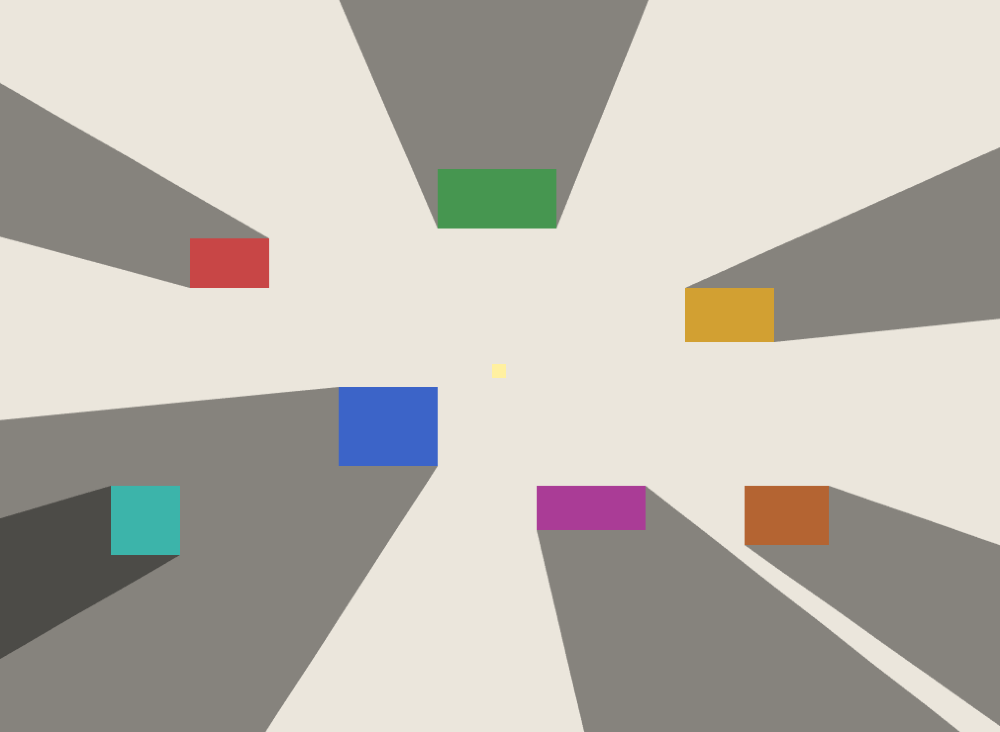

# shadows

Бесконечные 2D тени от точечных источников света для Ebitengine — как в *Thomas Was Alone*.

## Пакет `shadow`

```go
import "shadows/shadow"
```

```go
shadow.Draw(screen, shadow.Block{X, Y, W, H}, lightX, lightY, opts)
```

Рисует трапециевидную тень от прямоугольника в направлении от источника света.  
`opts` опционально (`nil` для значений по умолчанию):

```go
&shadow.Options{
    Color:     color.RGBA{0, 0, 0, 255},  // цвет тени
    Alpha:     0.43,                        // прозрачность
    Extrude:   3000,                        // дальность тени
    AntiAlias: true,
}
```

